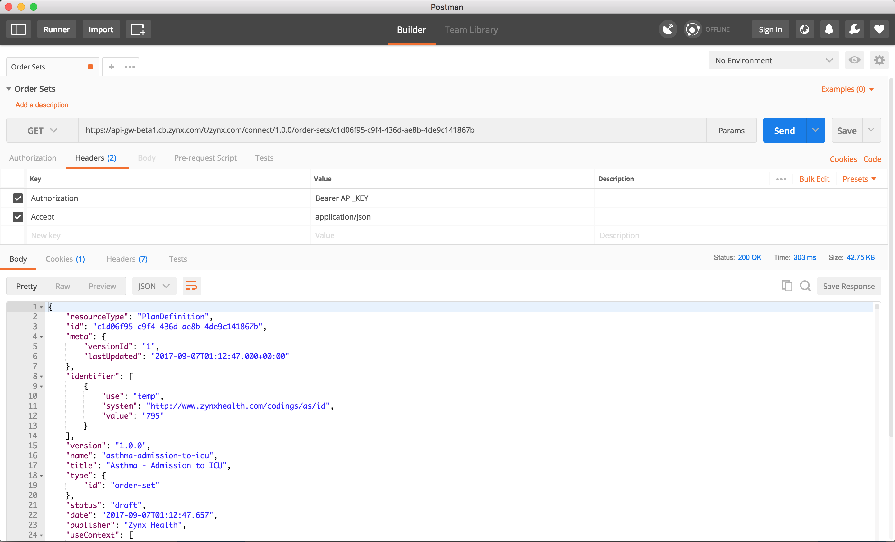

## Retrieve Order Set with Postman
These instructions are for the [Postman](https://www.getpostman.com) application, but you can use your own tool.

> Wherever `API_KEY` is referenced below, replace it with the unique key that was emailed to you.

1. Install [Postman](https://www.getpostman.com)
2. Launch Postman
3. Under "New Tab" select the verb GET
4. Enter this endpoint:
```
https://api-gw-beta1.cb.zynx.com/t/zynx.com/connect/1.0.0/order-sets/c1d06f95-c9f4-436d-ae8b-4de9c141867b
```
5. Click "Headers" and add the following key and value (`key:value`):

   | Key         | Value     | Description |
   | :---------- | :--------  | :---------- |
   | `Authorization` | `Bearer API_KEY`  | Key provided by Zynx Health for authentication| 
   | `Accept` | `application/json`  | The expected response type.  Change to `application/xml` for XML| 
   
   
6. Click "Send"



<br>

