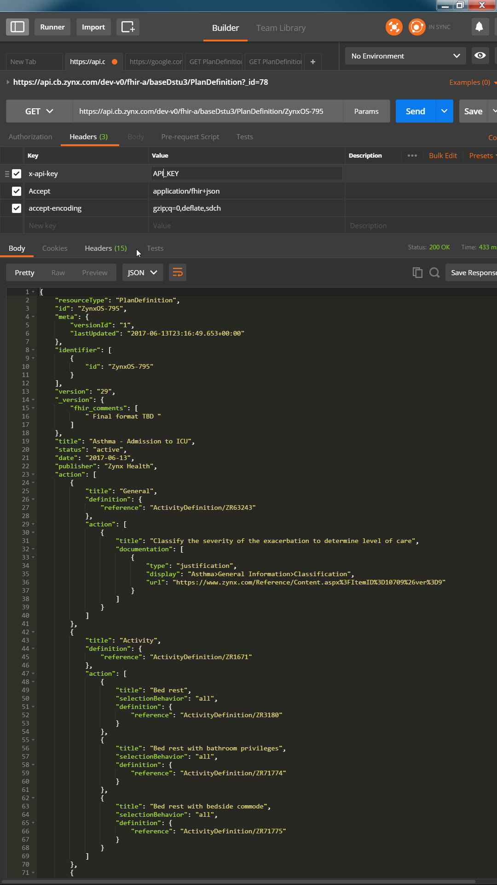
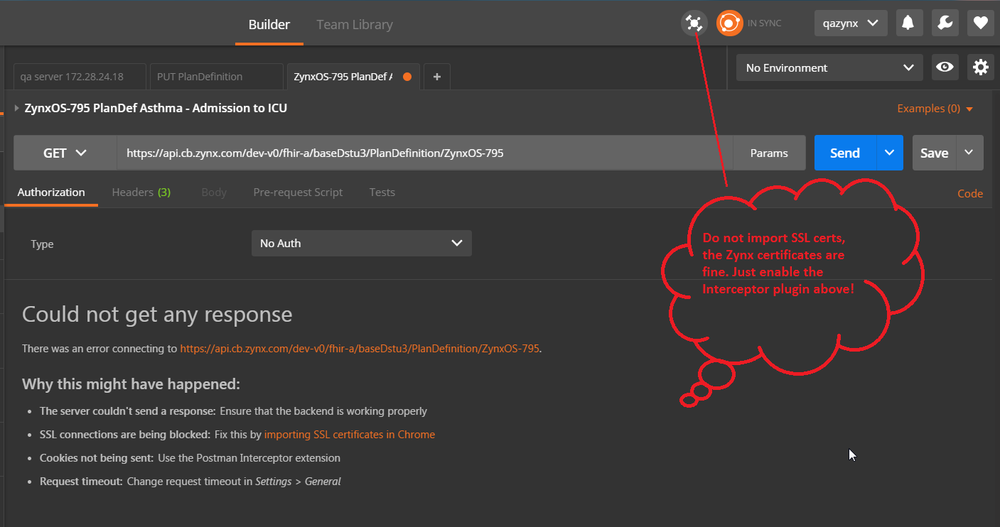

## Search for PlanDefinition with Postman GUI REST API tool
These instructions are for the [Postman App](https://www.getpostman.com), but you can use your own tool.

> Wherever `API_KEY` is referenced below, replace it with the unique key that was emailed to you.

1. Install Postman and [Interceptor](https://www.getpostman.com/docs/capture)
2. Launch Postman and from the top toolbar enable Interceptor 
3. Under "New Tab" select the verb GET
4. Enter this endpoint: `https://api.cb.zynx.com/dev-v0/fhir-a/baseDstu3/PlanDefinition`
5. Click "Params" and add the following key and value parameters (`key:value`):

   | Key            | Value Parameters |
   | :------------- | :--------------- |
   | `_lastUpdated` | `gt2017-03-01`   |
   | `_lastUpdated` | `lt2017-04-05`   |
   | `_format`      | `json`           |
   | `_pretty`      | `true`           |
   | `_summary`     | `text`           |
   
6. Click "Headers" and add the following key and value (`key:value`):

   | Key         | Value     | Description |
   | :---------- | :-------- | :---------- |
   | `x-api-key` | `API_KEY` | Key provided by Zynx Health for authentication |
   | `accept-encoding` | `gzip;q=0,deflate,sdch` | Disables gzip so Postman will work |

7. Click "Send"

 

> **NOTE:** If you get an error, there are no problems with the Zynx SSL certificate. Enable the Interceptor on the top tool bar, also make sure you have the correct header for gzip in step 6 and retry.

