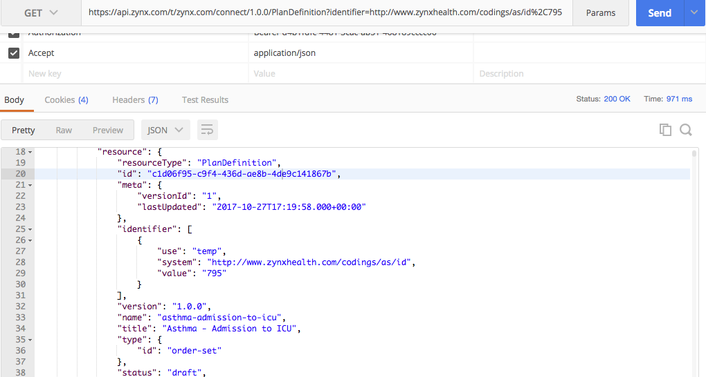
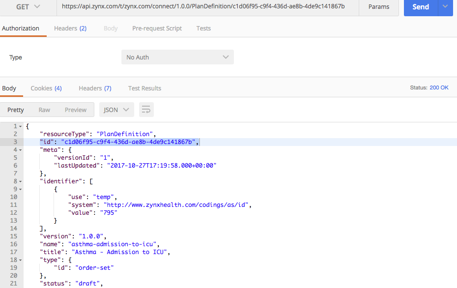

## FHIR Search Parameter by Zynx content ID examples:

Search parameter name: | Description 
 --- | --- 
GET Resource by **id** | returns all resources with Zynx unique id
 

| Example |
| --- |
| `https://api-gw-beta2.cb.zynx.com/t/zynx.com/connect/1.0.0/P/PlanDefinition?identifier=http://www.zynxhealth.com/codings/as/id%2C795` |
 

| Response |
| --- |
||
 

Search parameter name: | Description 
 --- | --- 
GET **Resource** | returns just the resource itself not a bundle
 

| Example |
| --- |
| `https://api-gw-beta2.cb.zynx.com/t/zynx.com/connect/1.0.0/PlanDefinition/c1d06f95-c9f4-436d-ae8b-4de9c141867b` |
 

| Response |
| --- |
||
 
